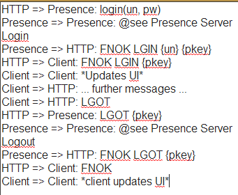
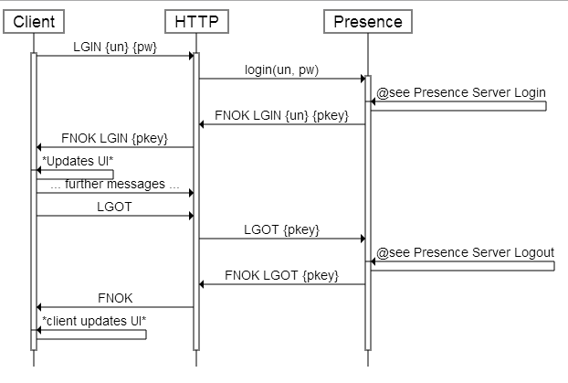

# rapidSeq v0.5

A text driven HTML 5 based sequence diagramming widget

## Versions

v0.5 (2013.12.07): Initial commit to repo. Functional barring minor graphical errors, hasn't seen rigorous cross-platform testing. Presently welded to example HTML page.

## A quick word from Jay

Hello!

I'm shocked you came across this already, so thank you for your interest!

rapidSeq was created as a productivity tool for another project that I'm presently working on, so its in a fairly "one off" state right now.
You're welcome to use it as it stands for your own purposes, but I would reccomend waiting until its been better tested and modularized for easier integration in a few days or weeks.

## Usage

To see it in action, pull the project to your environment of choice with a modern web browser, then load "index.html" in the root of the project.

In the lefthand text box, enter something like:

And the canvas should render an image like:

## Thanks

Thanks to both (HTML 5 Boilerplate)[http://html5boilerplate.com/] and (jQuery)[http://www.jquery.com] for making things easier on the project.

## Notes and Nitty Gritty

#### Global Values

BOX_DIST: A reserved pixel distance to account for existance indicators.
GUTTER_WIDTH: CONST to enforce horizontal spacing requirements.
keyDelayed: Timer to prevent excessive processing of instructions.
pal: a RAW reference to the 2D context of the app's <canvas> tag.
<palX, palY> are module visible to ensure canvas is correctly laid out.
Y_STEP: CONST to enforce a vertical spacing regime.

#### parseInstructions()

instructionSet: resultant parsed array of commands,
lineNumber: Used for human readable error messages,
reValidLine: See below ...
sources: A reference ordered array of Seq Diag objects.
textToParse: Array of lines to be parsed into instructions.

reValidLine is a multipart matching RegExp, roughly in the form of ...
  1) {optional /}{STRING}{optional /}{one space}{ARROW FORMAT}
  2) {>=1 spaces}{optional /}{STRING}{optional /}{colon} 
  3) {>=1 spaces}{message}